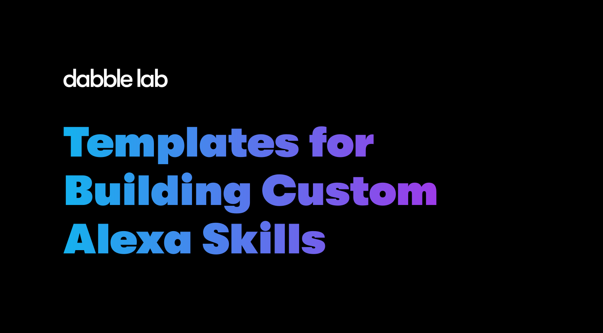

# Alexa Skill Template

Since 2017, Dabble Lab has shared [over 300 tutorials](https://youtube.com/dabblelab) and [50+ code templates](https://skilltemplates.com) for learning Alexa development. We're now using this repository to provide support for our templates. So, if you have questions or comments about any of our templates, you can [post them here](https://github.com/dabblelab/alexa-skill-templates/discussions) and we'll respond as quickly as possible. 

## About the templates

The templates are designed to make learning Alexa development faster and easier. Each template focuses on implementing a specific feature or use case. For example, one template shows how to use data from an external API, another provides an example for playing an audio stream. 

The primary purpose for the templates is learning. With that in mind, we try to provide fully-functional skills while keeping the code as simple as possible. This makes learning easier but the code isn't always suitable for production use. So, while you're welcome to use the templates for live skills, we don't provide any guarantees or support for production use cases.

## Getting started

To use the templates you'll need an Amazon developer account. You can sign up for a [free developer account here](https://developer.amazon.com). We have templates written for NodeJS and Python but not all of them are available in both languages. Also, in most cases, the templates were designed to run as [Alexa-Hosted skills](https://developer.amazon.com/en-US/docs/alexa/hosted-skills/build-a-skill-end-to-end-using-an-alexa-hosted-skill.html) but some my require resources that run on [AWS](https://aws.amazon.com).

## Available templates

You can find a list of [all our templates here](https://github.com/search?q=topic%3Aalexa-skill-template+org%3Adabblelab+fork%3Atrue) and a few of the more popular ones below.

| Template | Language | Description | Deploy |
| --- | --- | --- | --- |
| [Alexa Streaming Audio Skill](https://github.com/dabblelab/3-alexa-audio-streaming-example-skill) | NodeJS | A template for building a streaming audio player skill. ||
| [Alexa-Hosted S3 Audio Skill](https://github.com/dabblelab/alexa-hosted-s3-audio-example-skill) | NodeJS | An Alexa skill template that plays mp3 files in Alexa-Hosted S3 buckets. ||
| [Alexa Remote API Skill](https://github.com/dabblelab/3-alexa-audio-streaming-example-skill) | NodeJS | An example skill that shows how to use remote API data in an Alexa response. ||

## How you can contribute

If you find these templates useful and you'd like to support the project, you can do so in a number of ways:

- Star this repository to show your support.
- Star the repository of the templates you like best.
- Ask and answer questions about templates in the [GitHub Discussions](https://github.com/dabblelab/alexa-skill-templates/discussions).
- [Report a bug](https://github.com/dabblelab/alexa-skill-templates/issues) and help us verify it's a bug.
- [Submit a Pull Request](https://github.com/dabblelab/alexa-skill-templates/pulls) with a fix.
